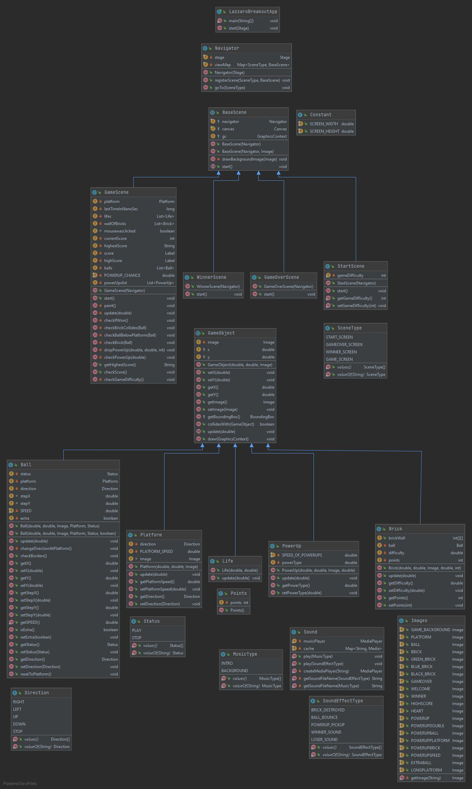
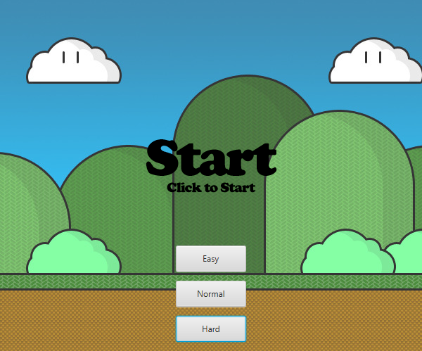
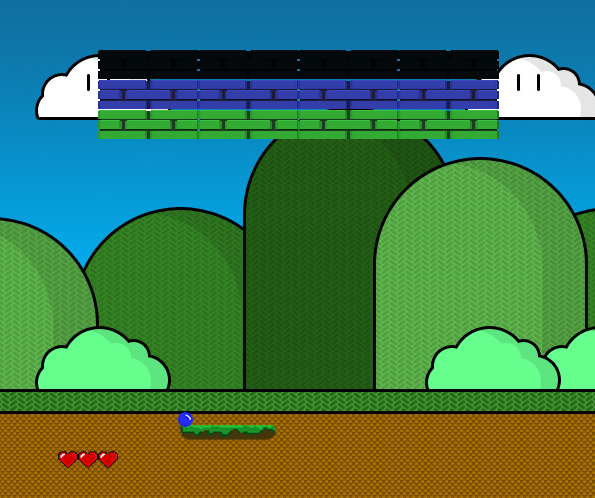
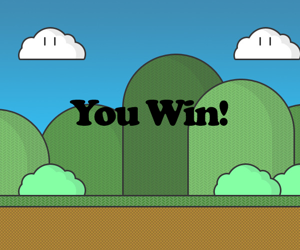

# Lazzaro Breakout

Projektbeschreibung

Ein Brick Breaker spiel im Stile von Atari Breakout. Der User kann mit der Maus die Plattform steuern und so den Ball nach oben lenken. Der Ball trifft auf die Ziegelsteine und zerschlägt diese. Je nach härte muss der Ziegelstein mehrmals getroffen werden.

## Unser Mokup

## Klassendiagramm

Das Klassendiagramm ist von oben nach unten zu lesen.   Die verschiedenen Szenen sind zusammengefasst sowie die verschiedenen Spielobjekte.

## Version 1.0

### Unser Startscreen

 Der Schwierigkeitsgrad wird gewählt und das Spiel gestartet.

### Unser Gamescreen

 Die Platform wird mit der Maus gesteuert und die Ziegelsteine für Punkte mit dem Ball zerstört werden.

### Unser Winnerscreen

 Sind alle Zeigelsteine zerstört, ist das Spiel gewonnen!

## Fazit
Wir haben enorme Fortschritte mit unseren Java-Kenntnissen gemacht. Die Grundlagen konnten wir festigen und weiter ausbauen.  
Vielen User Stories sind wir mit respekt begegnet, konnten aber viele davon rasch und kompetent lösen.
Die Zusammenarbeit im Team war gut, wir hatten ein gutes Arbeitsklima und arbeiteten vor allem in der ersten Hälfte zusammen am Code.
In einem nächsten Projekt würden wir die Aufteilung der User Stories noch konsequenter durchziehen.   
#### Wir hatten viel Spass beim Programmieren von Lazzaro Breakout und sind sehr stolz auf das Ergebnis.